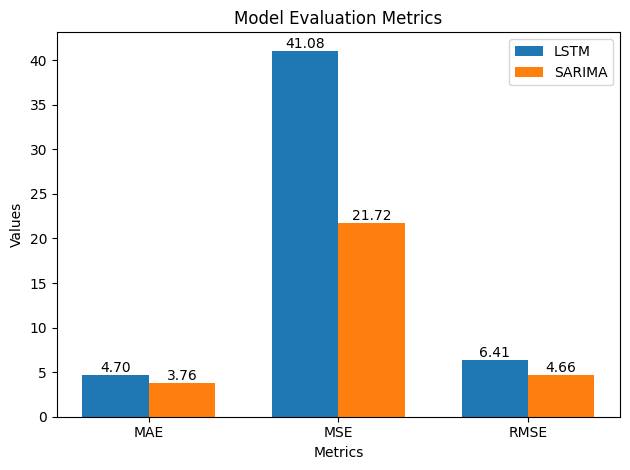

# E-Commerce-Predictive-Analysis-using-AWS

## Table of Contents
1. [Abstract](#abstract)
2. [Problem Statement](#problem-statement)
3. [Related Work](#related-work)
4. [Solution and Significance](#solution-and-significance)
5. [Evaluation Results](#evaluation-results)
6. [Architecture](#architecture)
7. [Limitations and Future Scope](#limitations-and-future-scope)
8. [Setup and Usage](#setup-and-usage)
9. [Contributors](#contributors)

---

## Abstract
This project investigates the use of predictive analytics in e-commerce by leveraging AWS services to forecast customer behavior and enhance decision-making. By employing machine learning models, including LSTM and SARIMA, the system predicts sales trends using historical data. AWS SageMaker is used for model training, AWS Lambda for automation, and Amazon QuickSight for visualization. The secure architecture integrates Amazon S3 as a central data repository. Evaluation metrics demonstrate the system’s reliability in forecasting short-term trends. Limitations such as cost constraints and frequent retraining are addressed, with potential future developments including integration with AWS IoT and advanced orchestration tools.

## Problem Statement
E-commerce businesses face challenges in forecasting customer behavior, leading to inefficiencies such as overstocking, stockouts, and missed engagement opportunities. Traditional methods struggle to handle the complexity and scale of modern data. By leveraging machine learning for predictive analytics, businesses can gain actionable insights, enabling better inventory management, demand forecasting, and personalized customer experiences.

## Related Work
The predictive modeling techniques in this project build on existing literature that demonstrates the effectiveness of machine learning in time-series forecasting. LSTM models are widely recognized for their ability to capture long-term dependencies in sequential data, while SARIMA is noted for handling seasonality and trends in time-series analysis. The integration of AWS services, such as SageMaker and Lambda, follows best practices for cloud-based analytics pipelines, providing scalability and automation. Existing implementations often highlight the trade-offs between computational cost and accuracy, which this project seeks to optimize.

## Solution and the significance
We integrated advanced predictive analytics with AWS cloud services to create a robust, scalable solution for e-commerce forecasting. Key novelties include:
The combined use of LSTM and SARIMA models for improved accuracy in capturing sequential and seasonal patterns.
Automation of data preprocessing, model training, and prediction workflows through AWS Lambda.
A secure and dynamic architecture using Amazon S3 for data storage and Amazon QuickSight for real-time visualization. The solution enhances decision-making efficiency by reducing manual interventions and providing stakeholders with interactive dashboards for actionable insights.

## Evaluation Result
The model's performance was evaluated using standard metrics:

| Metric                   | LSTM | SARIMA |
| -------------------------|------|--------|
| Mean Absolute Error (MAE)| 4.70 | 3.76|
| Mean Squared Error (MSE)| 41.08 | 21.72|
| root Mean Absolute Error (RMAE)| 4.70 | 3.76|

 
SARIMA outperformed LSTM in terms of accuracy, demonstrating its strength in handling seasonal trends. However, LSTM provided flexibility in capturing complex sequential dependencies, showcasing the complementary nature of these models. These results validate the system’s ability to provide reliable short-term forecasts.
