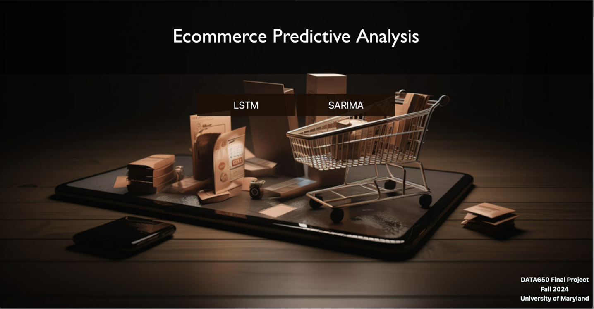

# E-Commerce-Predictive-Analysis-using-AWS

## Table of Contents
1. [Abstract](#abstract)
2. [Problem Statement](#problem-statement)
3. [Related Work](#related-work)
4. [Solution and Significance](#solution-and-significance)
5. [Evaluation Results](#evaluation-results)
6. [Architecture](#architecture)
7. [Limitations and Future Scope](#limitations-and-future-scope)
8. [Setup and Usage](#setup-and-usage)
9. [Contributors](#contributors)

---

# Abstract
This project investigates the use of predictive analytics in e-commerce by leveraging AWS services to forecast customer behavior and enhance decision-making. By employing machine learning models, including LSTM and Seasonal ARIMA, the system predicts sales trends using historical data. AWS SageMaker is used for model training, AWS Lambda for automation, and Amazon QuickSight for visualization. The secure architecture integrates Amazon S3 as a central data repository. Evaluation metrics demonstrate the system’s reliability in forecasting short-term trends. Limitations such as cost constraints and frequent retraining are addressed, with potential future developments including integration with AWS IoT and advanced orchestration tools.

# Problem Statement
E-commerce businesses are facing more difficulties in predicting what customers will do, which affects their operations and profits. These problems show up in different ways, like having too much stock, running out of products, or missing chances to connect with customers. Having too much inventory leads to high storage costs, while running out of products means lost sales and unhappy customers. Businesses may also miss chances to interact with customers in a personalized way or fail to use their marketing strategies well, which can hurt customer loyalty and satisfaction.

Traditional methods of forecasting, like basic statistical models or manual inventory management, often can't keep up with the complexity and size of today's e-commerce data. With the huge amounts of data from transactions, customer behavior, and demographics generated every day, these old methods can't spot the detailed patterns that influence customer actions. Because of this, businesses struggle to make smart, data-based decisions that could improve their forecasting and operations.

By using advanced machine learning methods for predictive analytics, e-commerce businesses can gain valuable insights into customer behavior. These insights help improve inventory management, predict demand more accurately, and create personalized experiences for customers. Machine learning models, such as time series forecasting, recommendation systems, and customer segmentation, can process large amounts of data in real-time to discover hidden patterns, enabling businesses to make smarter decisions. In the end, adopting machine learning for predictive analytics can help businesses reduce inefficiencies, boost customer satisfaction, and increase profitability in a competitive market.

# Related Work
The predictive modeling techniques in this project build on existing literature that demonstrates the effectiveness of machine learning in time-series forecasting. LSTM models are widely recognized for their ability to capture long-term dependencies in sequential data, making them highly effective for dynamic and complex datasets. Similarly,  SARIMA models are renowned for their robust handling of seasonality and trends, which can provide a complementary approach to time-series analysis. By integrating these models, the project leverages the strengths of both to deliver more accurate and reliable predictions. 

Additionally, the integration of AWS services, such as SageMaker and Lambda, follows best practices for cloud-based analytics pipelines, providing scalability and automation. The project also explores the trade-offs between computational cost and accuracy, a recurring theme in existing implementations, to strike a balance that optimizes performance without compromising efficiency. By addressing these considerations, this project not only builds on the current state-of-the-art but also contributes insights into the practical application of machine learning and cloud-based solutions for time-series forecasting.

# Architecture
We started off by collecting raw data that we securely stored in an AWS S3 bucket which serves as the central repository for both our inputs and outputs. Preprocessed data from time-series sources is then ingested into Amazon SageMaker through a Virtual Private Cloud (VPC), where we are training and using our implemented LSTM and SARIMA models. Once we are able to generate predictions, they are stored back in the S3 bucket. To ensure that predictions are being uploaded to the bucket, we configured an AWS Lambda feature which sends updates to a cloudwatch that records logs of when the data was uploaded. We then use AWS Quicksight to then visualize the latest prediction in dynamic dashboards which will provide real-time insights to the business. Key security features include the use of IAM roles, policies and VPC isolation enforcing role-based access control allowing only necessary permissions for all the services used. The use of a VPC ensures secure communication between services like SageMaker and S3 through subnets and security groups where this architecture design balances efficiency, scalability and security, enabling reliable AI-driven decision making. 

# Implementation Tools
The project leverages Amazon SageMaker as the cornerstone for predictive analytics. SageMaker enables a managed environment for training, testing, and deploying machine learning models-specifically, the LSTM and SARIMA models used in this project. It handles data preprocessing, builds rolling-window models, and supports experimentation through its integrated Jupyter notebooks. SageMaker offers powerful computing resources, hence being efficient for handling big data sets and computations-a perfect tool for predictive analytics in e-commerce. Moreover, SageMaker has seamless integration with Amazon S3, both for fetching raw data and storing the processed output for a well-organized data pipeline.

AWS Lambda plays a vital role in workflow automation and adding more efficiency to the system. Lambda reduces manual intervention and ensures consistent data preprocessing by triggering workflows whenever new data is uploaded to S3. It also automates the execution of predictions and updates QuickSight dashboards in real time, creating a dynamic and responsive architecture. This allows event-driven pipeline implementation due to the capability of Lambda for serverless automation, besides its seamless integration with other AWS services. This adds to the overall agility and scalability of the system.

# Solution and the significance
We integrated advanced predictive analytics with AWS cloud services to create a robust, scalable solution for e-commerce forecasting. Key novelties include:
The combined use of LSTM and SARIMA models for improved accuracy in capturing sequential and seasonal patterns.
Automation of data preprocessing, model training, and prediction workflows through AWS Lambda.
A secure and dynamic architecture using Amazon S3 for data storage and Amazon QuickSight for real-time visualization. The solution enhances decision-making efficiency by reducing manual interventions and providing stakeholders with interactive dashboards for actionable insights.

# Methodlogy / Solution

A. Forecasting models
The combined use of LSTM and SARIMA models enhances prediction accuracy by effectively capturing both sequential and seasonal patterns in the data. AWS Lambda automates the entire workflow, streamlining data preprocessing, model training, and prediction processes, which reduces manual intervention. A secure and dynamic architecture is implemented using Amazon S3 for reliable data storage and Amazon QuickSight for real-time, interactive visualizations. This integrated approach not only optimizes efficiency but also empowers stakeholders with actionable insights through intuitive dashboards, ultimately enhancing decision-making capabilities.

B. User Interface
The custom user interface designed for this project provides a user-friendly platform to interact with and view time-series forecasts and visualizations of predicted sales data. It seamlessly integrates with AWS QuickSight to display dynamic and interactive dashboards that present key metrics, trends, and forecasted data through intuitive charts and graphs. AWS Lambda plays a crucial role in automating the process by triggering whenever new predictions are generated in SageMaker, automatically storing them in an S3 bucket. Lambda then updates the QuickSight dashboard with the latest data, ensuring the visualizations are always up-to-date. This integration streamlines the entire process, reducing manual intervention and offering users real-time insights through the UI, while leveraging cloud automation for efficiency and scalability.

# Evaluation Result
The model's performance was evaluated using standard metrics:

| Metric                   | LSTM | SARIMA |
| -------------------------|------|--------|
| Mean Absolute Error (MAE)| 4.70 | 3.76|
| Mean Squared Error (MSE)| 41.08 | 21.72|
| root Mean Absolute Error (RMAE)| 4.70 | 3.76|

 
SARIMA outperformed LSTM in terms of accuracy, demonstrating its strength in handling seasonal trends. However, LSTM provided flexibility in capturing complex sequential dependencies, showcasing the complementary nature of these models. These results validate the system’s ability to provide reliable short-term forecasts.

# Limitations

## Model Specificity
These predictive models, LSTM and SARIMA, are particularly trained on the current dataset and rely on some assumptions regarding patterns in data. In case of serious changes in consumer behavior, seasonality, or exogenous factors, these models will be less effective, requiring frequent retraining. This increases operational overhead and makes the system less adaptable to evolving trends in the data.

## Cost and Scalability
Although AWS provides services such as SageMaker and QuickSight that offer powerful functionality, using these services for very large datasets or computationally expensive models can be cost-prohibitive. Limitations in the types of SageMaker instances available, along with other resource constraints, may require additional optimization or the use of more economical scaling strategies to maintain affordability and performance.

## Generalization of Data
The current design of the system may not generalize well for highly dynamic or irregular data patterns. Predictive models can have a hard time adapting to extreme changes in the dataset without manual intervention or architectural changes. This reduces flexibility and may necessitate continuous adjustments to maintain the accuracy and reliability of the predictions.

# Conclutions

## Efficient Integration
The project shows how Amazon SageMaker, Lambda, S3, and QuickSight work together effectively for a seamless and automated pipeline. These services empower the system to simplify the most complicated machine learning workflows-from data preprocessing and model training to updating predictions in real time-and reduce manual intervention to achieve more operational agility, thereby driving robust e-commerce predictive analytics with efficiency.

## Actionable Insights
Integrating Amazon QuickSight as a visualization layer allows raw predictions to be transformed into interactive, dynamic dashboards that stakeholders can use to explore trends and insights. These are dashboards where updates can be made in real-time, thus making the decision-making process truly data-driven and actionable. The flexibility in filters and customization options makes sure the insights remain relevant across varying business needs.

## Scalability for the Future
With this architecture, there is great potential for enhancements to be made in the future, such as the addition of AWS IoT or Kinesis for real-time data streaming and EventBridge or Step Functions for advanced automation. This will enhance the system's ability to scale, be reliable, and respond to changing data needs with ease, thereby being useful for businesses seeking to scale predictive analytics to meet more complex or larger-scale demands.
